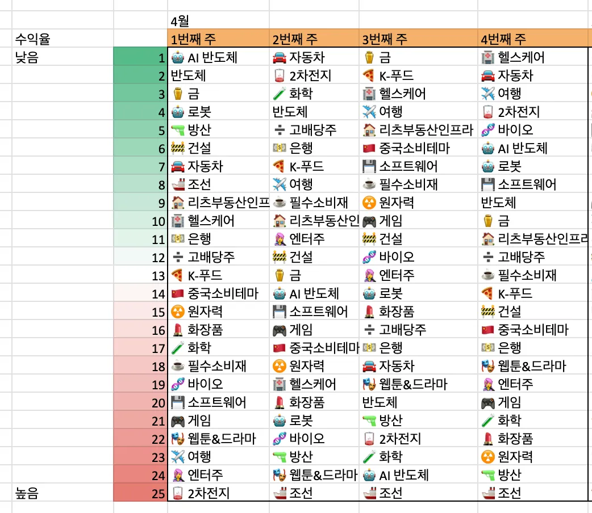
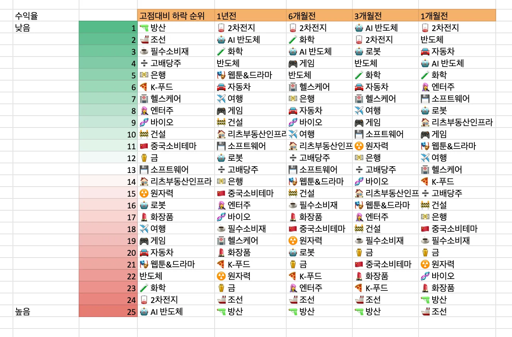
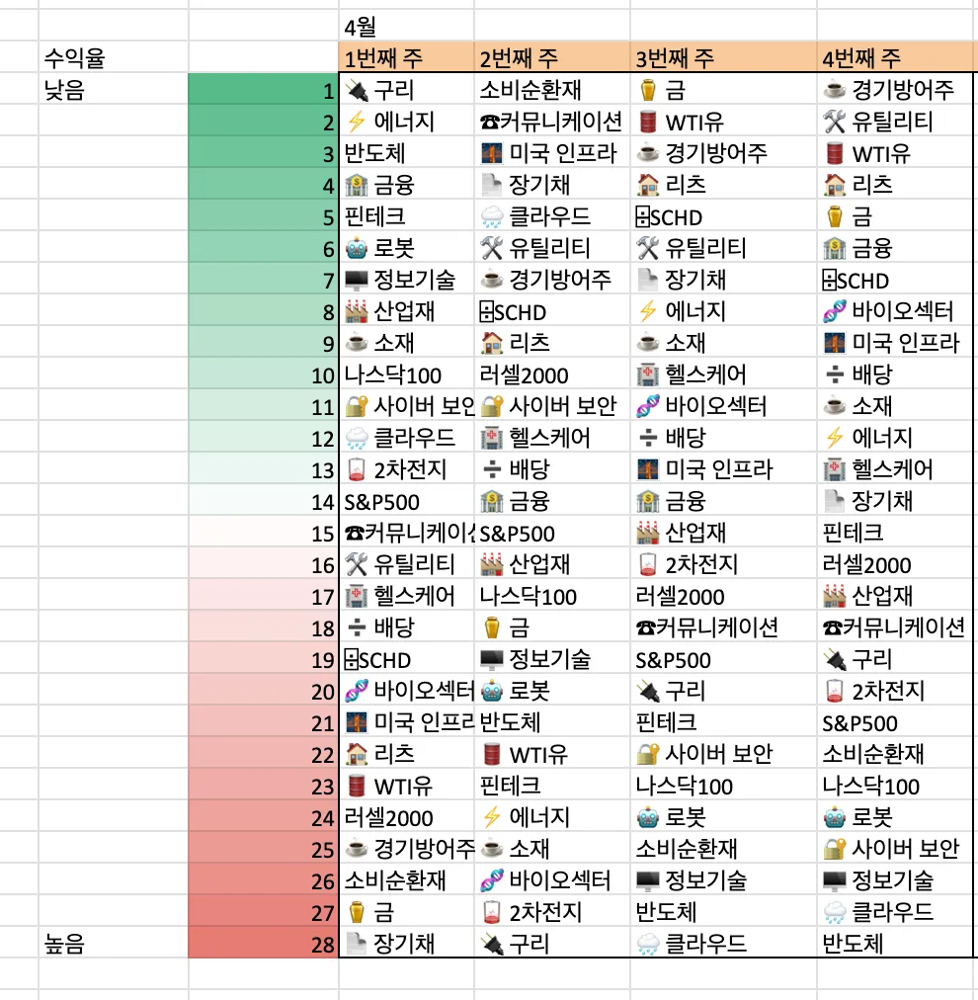
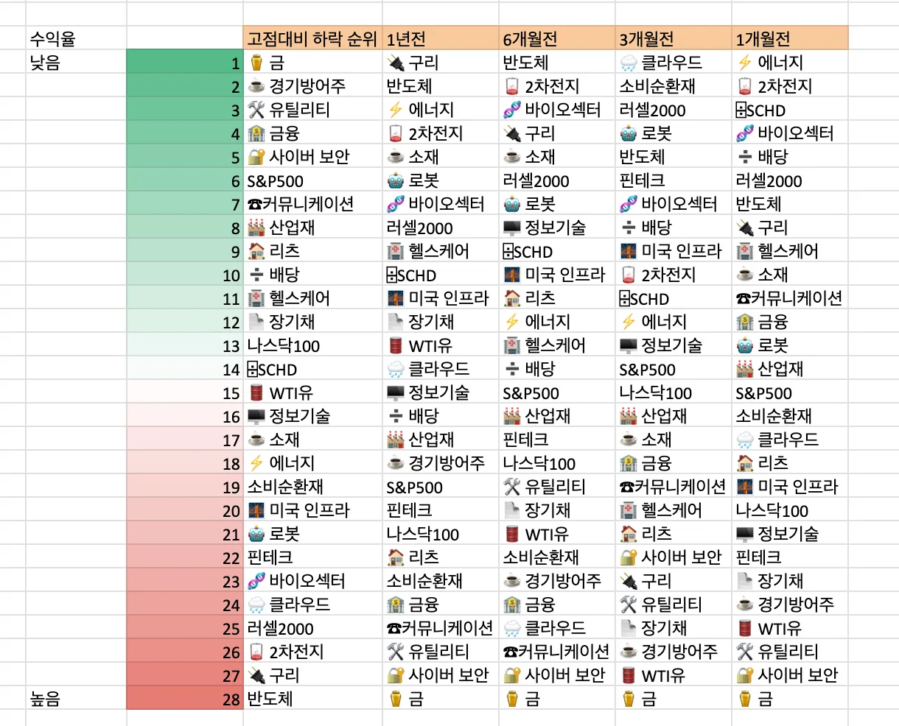
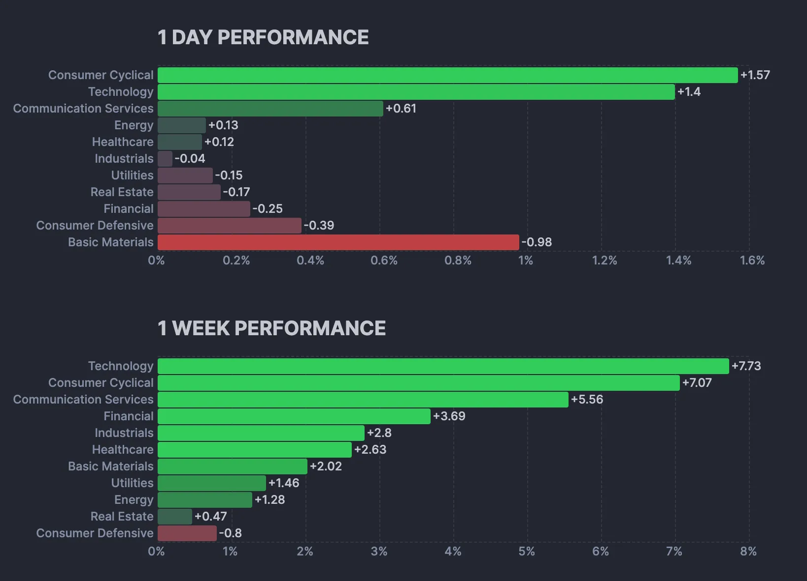
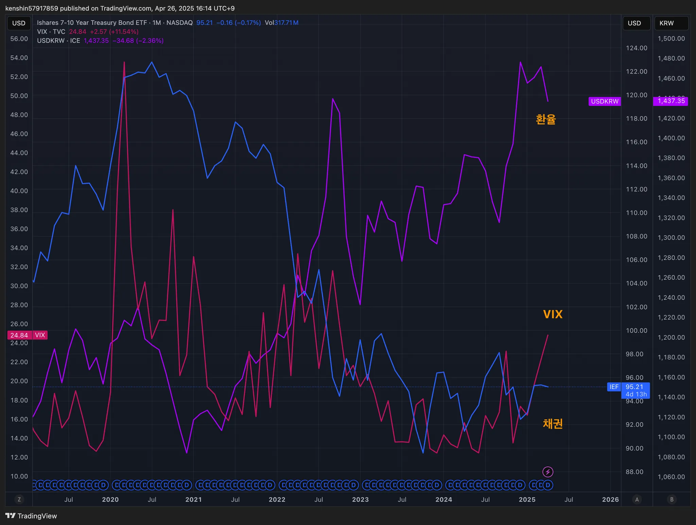
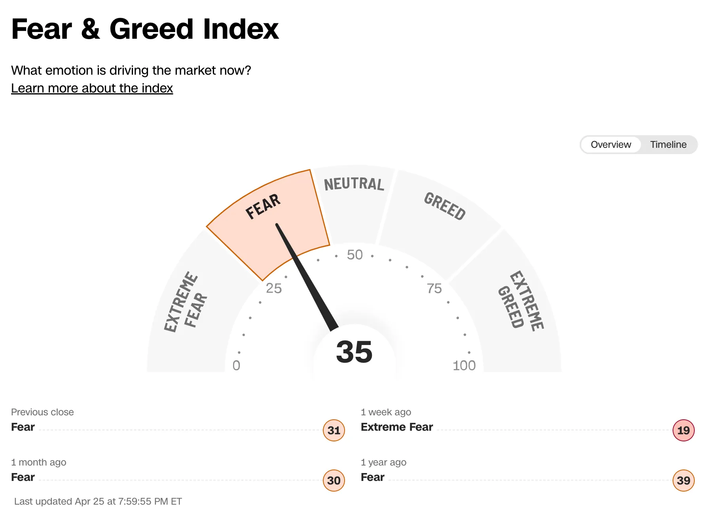
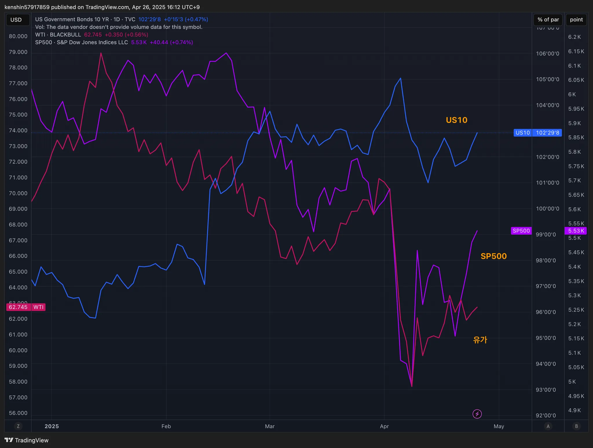
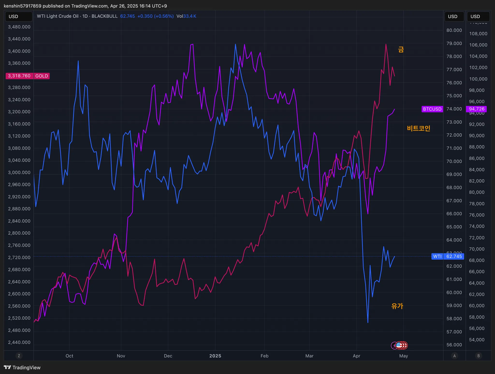

## 섹터별 수익률

> ETF 수익률을 기준으로 섹터별 수익률을 정렬하고 시간이 지남에 따라 현재 시장에서 주목받는 섹터가 무엇인지 파악하기 위해 아래와 같이 수익률을 정리해보았다.
>
> 단순히 수익률 기준으로 정렬을 하고 있어서 해당 섹터가 시장에서 가장 주목 받고 있다고 단정하기는 어렵지만, 투자하는 데 참고 지표로 사용하면 될 것 같다.

## 1. 국내 ETF

### 섹터별 ETF 종목

| **섹터** | **종목**               | **섹터**      | **종목**              |
| ---------- | ---------------------- | ----------------- | ---------------------- |
| 🔫방산      | PLUS K방산             | ☕️필수소비재       | KODEX 필수소비재       |
| ☢️원자력    | HANARO 원자력iSelect   | 🎮게임             | KBSTAR 게임테마        |
| ⚱️금        | ACE KRX금현물          | 🏠리츠부동산인프라 | TIGER 리츠부동산인프라 |
| 🏥헬스케어  | TIGER 헬스케어         | 💾소프트웨어       | TIGER 소프트웨어       |
| 🚢조선      | HANARO Fn조선해운      | 🍕K-푸드           | HANARO Fn K-푸드       |
| 🤖로봇      | KODEX K-로봇액티브     | ✈️여행             | TIGER 여행레저         |
| 👩‍🎤엔터주   | HANARO Fn K-POP&미디어 | 🇨🇳중국소비테마    | TIGER 중국소비테마     |
| ➗고배당주  | PLUS 고배당주          | 🚘자동차           | KODEX 자동차           |
| 💵은행      | KODEX 은행             | 반도체            | KODEX 반도체           |
| 🚧건설      | TIGER 200 건설         | 💄화장품           | TIGER 화장품           |
| 🧬바이오    | KODEX 바이오           | 🎭웹툰&드라마      | KODEX Fn웹툰&드라마    |
| 🪫2차전지   | TIGER 2차전지테마      | 🤖AI 반도체        | TIGER AI반도체핵심공정 |
|            |                        | 🧪화학             | KODEX 에너지화학       |

## 2. 미국 ETF

### 섹터별 ETF

| 섹터         | **티커** | **섹터**      | **티커** |
| ------------ | -------- | ------------- | -------- |
| 🤖로봇        | BOTZ     | 핀테크        | FINX     |
| 🌧️클라우드    | CLOU     | 소비순환재    | XLY      |
| 🏥헬스케어    | XLV      | 🧬바이오섹터   | IBB      |
| ⚱️금          | GLD      | ⌹SCHD         | SCHD     |
| 🏭산업재      | XLI      | 🏦금융         | XLF      |
| ⚡️에너지      | XLE      | S&P500        | VOO      |
| 러셀2000     | IWM      | ☕️경기방어주   | XLP      |
| 🔌구리        | COPX     | 🔐사이버 보안  | CIBR     |
| 🌉미국 인프라 | PAVE     | ☕️소재         | XLB      |
| 🏠리츠        | XLRE     | 반도체        | SOXX     |
| 🛢️WTI유       | CL       | 🖥️정보기술     | XLK      |
| 🛠️유틸리티    | XLU      | 나스닥100     | QQQ      |
| 📄장기채      | TLT      | ☎커뮤니케이션 | XLC      |
| ➗배당        | DIA      | 🪫2차전지      | LIT      |

## 3. 주요 지표

### 3.1 환율, 채권, VIX

- VIX: 극심한 공포 주간을 벗어나기는 했지만, 아직 공포구간으로 증시가 Up & Down을 하고 있는 추세이다
- 환율: 달러가 내려가고 있어서 꾸준히 달러를 모을 필요가 있다

### 3.2 S&P500, US10, WTI유가

- 증시는 극심한 공포를 벗어나면서 증시는 조금씩 회복하는 추세이고 생각보다 빠르게 회복하고 있어서 더 줍줍을 할 걸 그랬다는 생각이 들었다.
  - 미래를 모르기 때문에 이럴 때 일 수록 안전자산 확보 (달러, 채권)를 필수라는 생각이고
  - 한 섹터에 올인하기보다는 이럴때 일 수록 다른 섹터에 있는 다양한 종목을 매수해야 자연스럽게 분산투자가 된다고 생각이 든다

### 3.3 BTC, GOLD, WTI

- 금: 공포구간을 조금씩 벗어나면서 안전자산이 금은 반대로 내려가고 있다
- 비트코인: 주식이 조금씩 회복하는 것처럼 비트코인도 다시 회복세를 보이고 있다

## 4. 주요 트렌드 정리

### 주요 일정 (4/28~ 5/2)

|      | 월                                                           | 화                                                           | 수                                                           | 목                                                           | 금                                              |
| ---- | ------------------------------------------------------------ | ------------------------------------------------------------ | ------------------------------------------------------------ | ------------------------------------------------------------ | ----------------------------------------------- |
| 일정 | 🇰🇷 트럼프 주니어 방한                                        | 🇯🇵 일본증시 휴장 🇺🇸 3월 구인 및 이직보고서 🇺🇸 4월 소비자 신뢰지수 | 🇺🇸 4월 ADP 취업자 변동 🇺🇸 3분기 개인소득, 개인소비지출   | 🇰🇷 휴장 🇨🇳 노동절 연휴 휴장 🇺🇸 ISM 제조업지수 🇺🇸 4월 제조업 PMI 확정치 | 🇺🇸 4월 고용동향보고서 🇰🇷 4월 소비자물가동향 |
| 실적 | 🇰🇷 한화오션 🇰🇷 LG생활건강 🇰🇷 두산밥캣 🇰🇷 HD현대건설기계 | 🇺🇸 GM 🇺🇸 KO 🇺🇸 PFE 🇺🇸 SBUX 🇰🇷 에코프로비엠 🇰🇷 SOOP 🇰🇷 하이브 🇰🇷 크래프톤 🇰🇷 한화시스템 | 🇺🇸 MSFT 🇺🇸 META 🇺🇸 QCOM 🇰🇷 두산에너빌리티 ��🇷 LG에너빌리티 🇰🇷 아모레퍼시픽 🇰🇷 한국항공우주  🇰🇷 한국비전 | 🇺🇸 AAPL 🇺🇸 LLY 🇺🇸 AMZN                               | 🇺🇸 XOM                                          |

- 🇰🇷 트럼프 주니어 방한 예정
- 🇰🇷 🇺🇸 실적 발표가 모여있는 한 주이다
- 🇰🇷 국민의 힘 대선 후보 3차 경선 진출자 확정
- 🇰🇷 한덕수, 출마 선언 가능성 29~30일

# **5. 참고**

- [증시일정](https://securities.miraeasset.com/hkr/hkr1003/n13.do)
- [한국 결제캘린더](https://kr.investing.com/economic-calendar/)
- [수익의 신채널](https://contents.premium.naver.com/season/god/contents/250426173234334hq)
- [가도넷](https://contents.premium.naver.com/0301/gadonet/contents/250427100426593kk)
