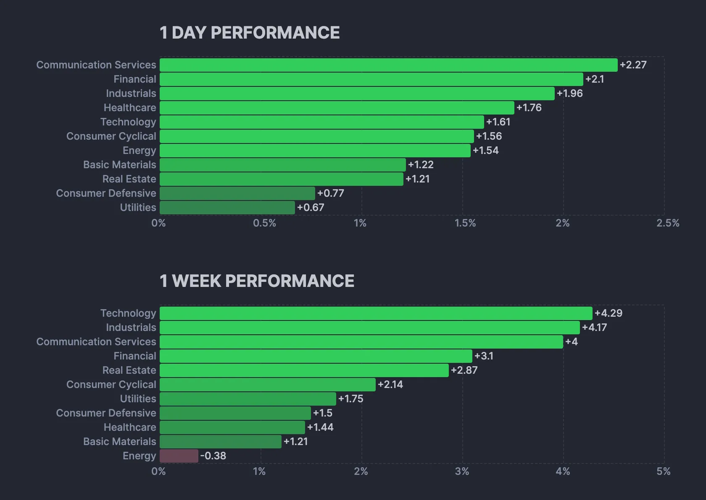
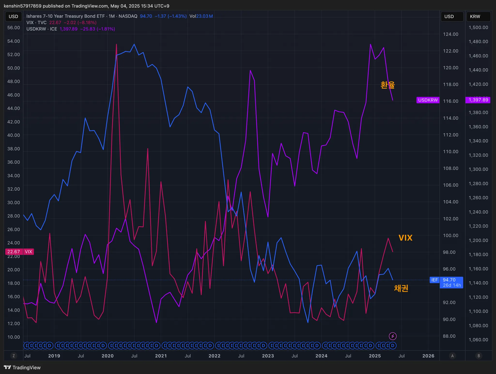
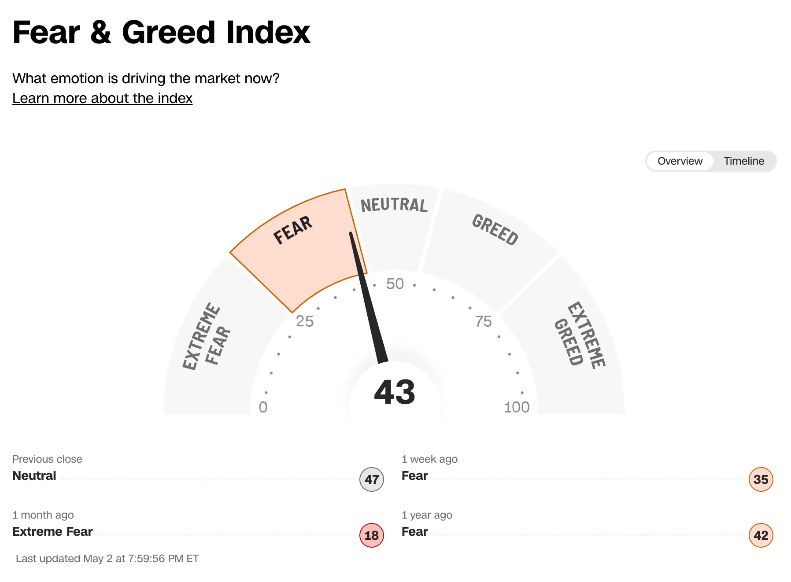
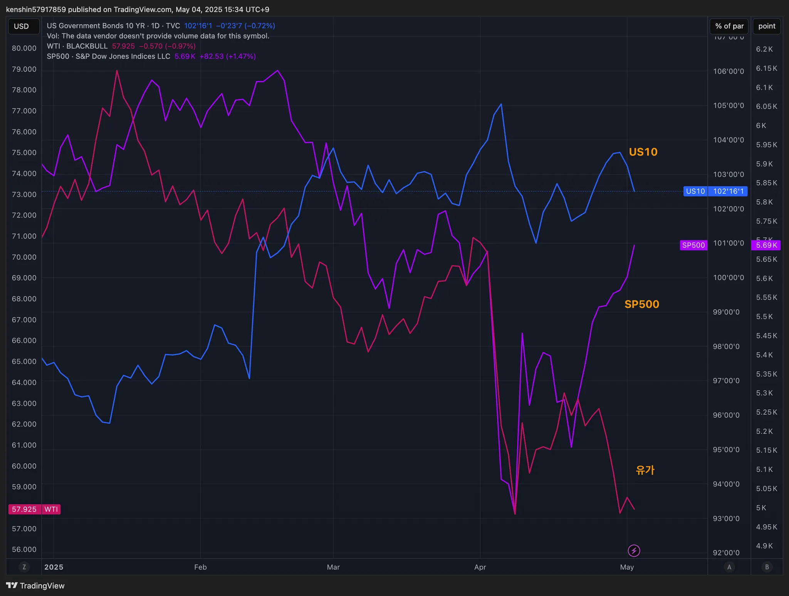
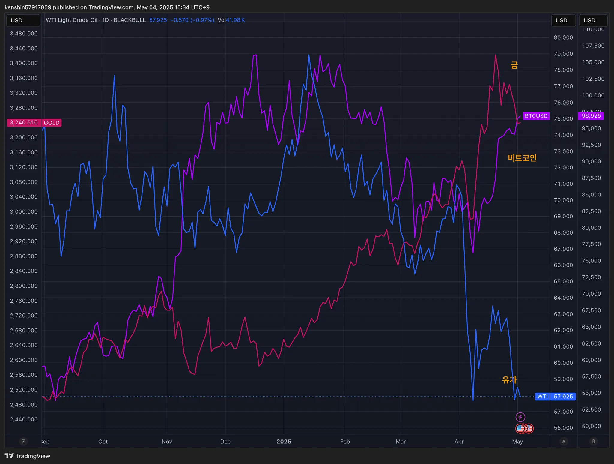

## 섹터별 수익률

> ETF 수익률을 기준으로 섹터별 수익률을 정렬하고 시간이 지남에 따라 현재 시장에서 주목받는 섹터가 무엇인지 파악하기 위해 아래와 같이 수익률을 정리해보았다.
>
> 단순히 수익률 기준으로 정렬을 하고 있어서 해당 섹터가 시장에서 가장 주목 받고 있다고 단정하기는 어렵지만, 투자하는 데 참고 지표로 사용하면 될 것 같다.

## 1. 국내 ETF

](image-20250505165027440.png)

### 섹터별 ETF 종목

| **섹터** | **종목**               | **섹터**      | **종목**              |
| ---------- | ---------------------- | ----------------- | ---------------------- |
| 🔫방산      | PLUS K방산             | ☕️필수소비재       | KODEX 필수소비재       |
| ☢️원자력    | HANARO 원자력iSelect   | 🎮게임             | KBSTAR 게임테마        |
| ⚱️금        | ACE KRX금현물          | 🏠리츠부동산인프라 | TIGER 리츠부동산인프라 |
| 🏥헬스케어  | TIGER 헬스케어         | 💾소프트웨어       | TIGER 소프트웨어       |
| 🚢조선      | HANARO Fn조선해운      | 🍕K-푸드           | HANARO Fn K-푸드       |
| 🤖로봇      | KODEX K-로봇액티브     | ✈️여행             | TIGER 여행레저         |
| 👩‍🎤엔터주   | HANARO Fn K-POP&미디어 | 🇨🇳중국소비테마    | TIGER 중국소비테마     |
| ➗고배당주  | PLUS 고배당주          | 🚘자동차           | KODEX 자동차           |
| 💵은행      | KODEX 은행             | 반도체            | KODEX 반도체           |
| 🚧건설      | TIGER 200 건설         | 💄화장품           | TIGER 화장품           |
| 🧬바이오    | KODEX 바이오           | 🎭웹툰&드라마      | KODEX Fn웹툰&드라마    |
| 🪫2차전지   | TIGER 2차전지테마      | 🤖AI 반도체        | TIGER AI반도체핵심공정 |
|            |                        | 🧪화학             | KODEX 에너지화학       |

## 2. 미국 ETF

- 이번주는 거의 모든 섹터가 플러스로 전환하기 사직했다

### 섹터별 ETF

| 섹터         | **티커** | **섹터**      | **티커** |
| ------------ | -------- | ------------- | -------- |
| 🤖로봇        | BOTZ     | 핀테크        | FINX     |
| 🌧️클라우드    | CLOU     | 소비순환재    | XLY      |
| 🏥헬스케어    | XLV      | 🧬바이오섹터   | IBB      |
| ⚱️금          | GLD      | ⌹SCHD         | SCHD     |
| 🏭산업재      | XLI      | 🏦금융         | XLF      |
| ⚡️에너지      | XLE      | S&P500        | VOO      |
| 러셀2000     | IWM      | ☕️경기방어주   | XLP      |
| 🔌구리        | COPX     | 🔐사이버 보안  | CIBR     |
| 🌉미국 인프라 | PAVE     | ☕️소재         | XLB      |
| 🏠리츠        | XLRE     | 반도체        | SOXX     |
| 🛢️WTI유       | CL       | 🖥️정보기술     | XLK      |
| 🛠️유틸리티    | XLU      | 나스닥100     | QQQ      |
| 📄장기채      | TLT      | ☎커뮤니케이션 | XLC      |
| ➗배당        | DIA      | 🪫2차전지      | LIT      |

## 3. 주요 지표

### 3.1 환율, 채권, VIX

- 채권**·**환율: 채권, 환율은 내려가고 있는 추세이다
- VIX: 공포지수는 점점 공포구간을 벗어나고 있는 추세를 보이고 있다
  - 트럼프 행정부의 무역 갈등 완화 기대감으로 조금씩 회복을 하는게 아닌가 싶다

### 3.2 S&P500, US10, WTI유가

- S&P 500: S&P500, 나스닥, 다우존스 모두 5월 첫 거래주(5/2 마감 기준)까지 연중 최고치 경신 및 8거래일 연속 상승을 기록중이다
  - 기술주가 강세를 주도하면서 대형 미국 IT(MSFT, META)의 실적 호조가 투자 심리를 크게 끌어올린듯하다

### 3.3 BTC, GOLD, WTI

- 금: 주식의 회복 추세로 안전자산인 금은 오히려 내려가는 추세로 변경이 되었다
- 비트코인: 주식과 같이 비트코인도 회복하는 추세이다

## 4. 주요 트렌드 정리

### 주요 일정 (5/5~ 5/9)

|      | 월                           | 화                           | 수                                                 | 목                                                           | 금                                                           |
| ---- | ---------------------------- | ---------------------------- | -------------------------------------------------- | ------------------------------------------------------------ | ------------------------------------------------------------ |
| 일정 | 🇺🇸 ISM제조업지수 🇰🇷 연휴 | 🇺🇸 3월 무역수지 🇰🇷 연휴 | 🇺🇸 FOMC 회의 🇰🇷 한수원-체크 원전 본계약 체결   |                                                              | 🇺🇸 실업률, 비농업 고용수 🇺🇸 첫 암호화폐 서밋 🇺🇸 파월 연설 🇨🇳 무역수지 |
| 실적 | 🇺🇸 F                         | 🇺🇸 AMD                       | 🇺🇸 UBER 🇺🇸 DIS 🇰🇷 에스엠 🇰🇷 카카오뱅크 | 🇺🇸 AVGO 🇰🇷 LIG넥스원 🇰🇷 스튜디오드래곤 🇰🇷 미래에셋증권 | 🇹🇼 TSMC 🇰🇷 네이버 🇰🇷 고려아연 🇰🇷 셀트리온 🇰🇷 코웨이 |

### 저번주

- 🇺🇸 빅테크 실적 호조: 메타, 마이크로소프트 등 AI·클라우드 중심 기업들의 1분기 실적이 시장 기대를 상회했다
- 🇺🇸 4월 고용지표가 예상보다 양호하게 발표되며 경기 침체 우려 완화
- 관세 및 무역 관련 악재가 추가로 없었고 중국과의 무역 협상도 최악으로 진행되지 않는 듯해서 이런 기대감에 증시가 올라간 듯하다

### 이번주

  - 🇺🇸 미국 FOMC 발언 및 CPI 지표 발표 주목
    - 금리 동결 예상이 되지만, 발표에 따라서 미국 증시가 크게 흔들릴 수 있다

## 5. 참고

- [증시일정](https://securities.miraeasset.com/hkr/hkr1003/n13.do)
- [한국 결제캘린더](https://kr.investing.com/economic-calendar/)
- [주부엉의 주식레시피](https://contents.premium.naver.com/owlstock/owlrecipe/contents/250427192358200fr)
- [YH 시장분석소](https://yhw5285.tistory.com/457)
