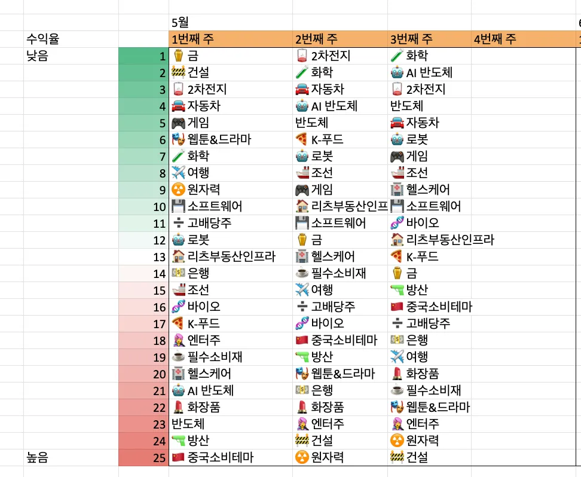
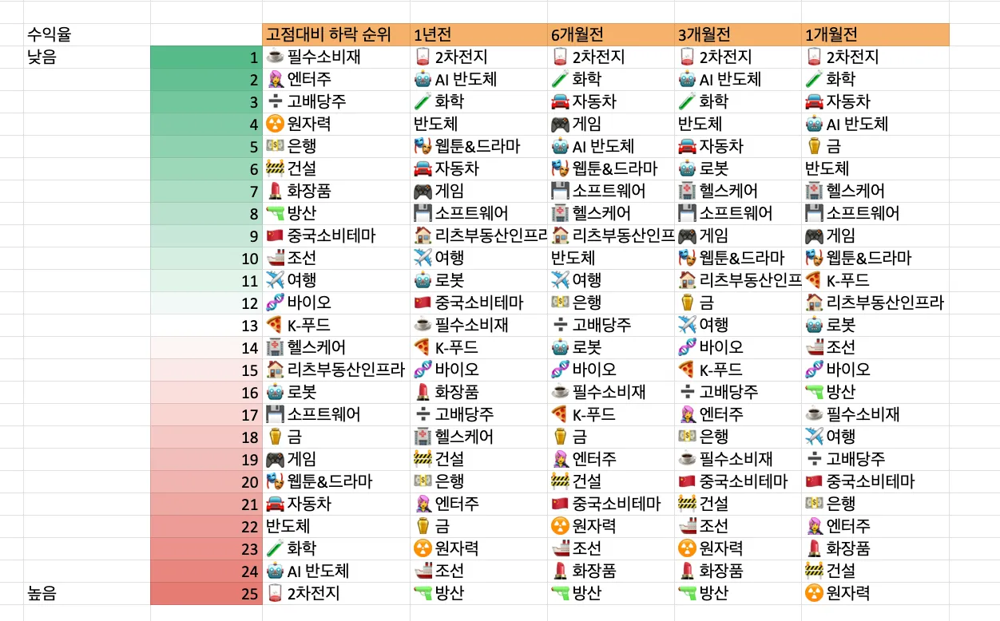
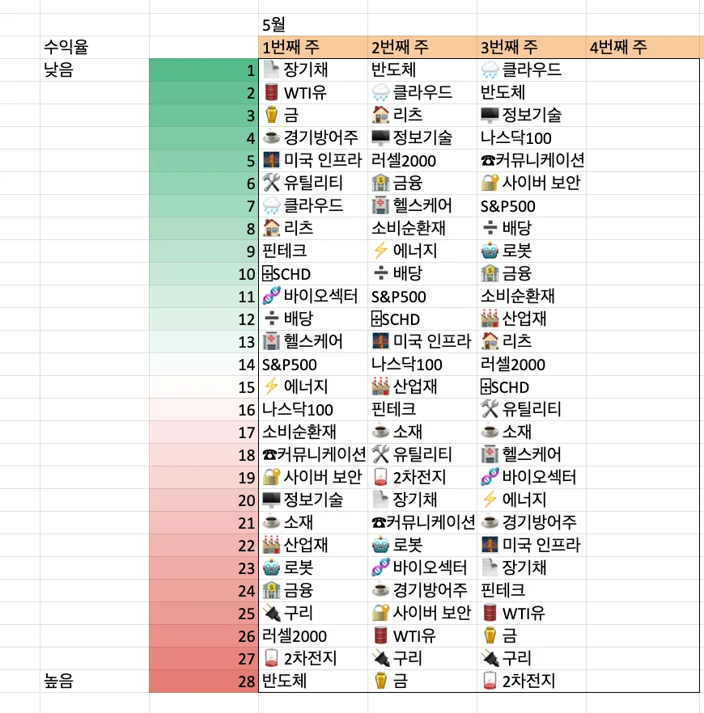
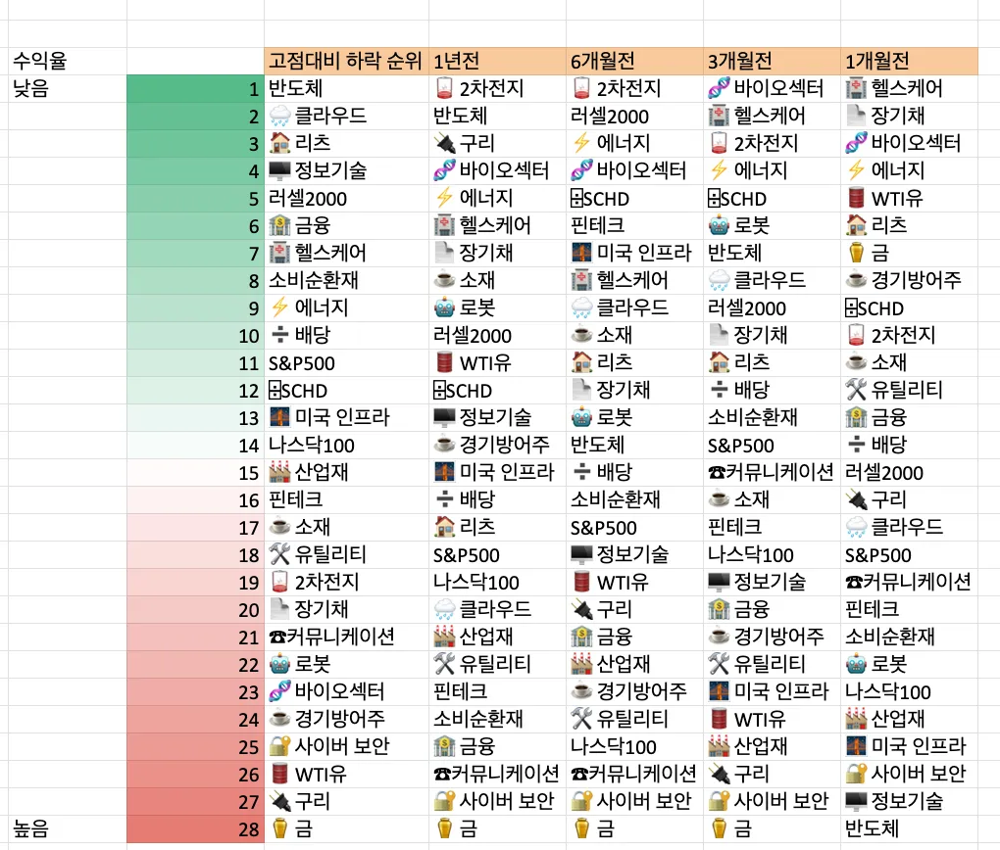
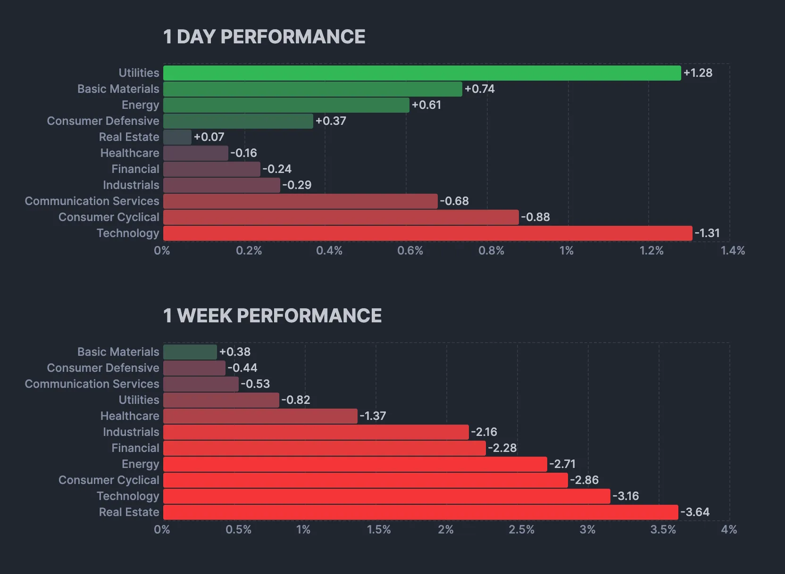
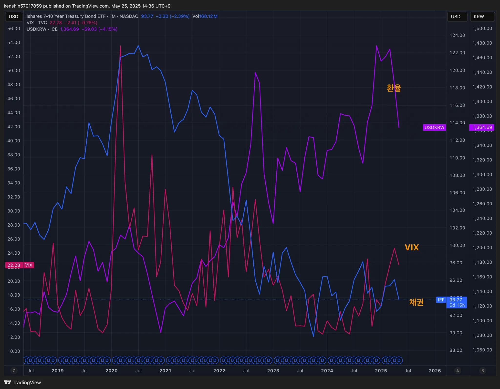
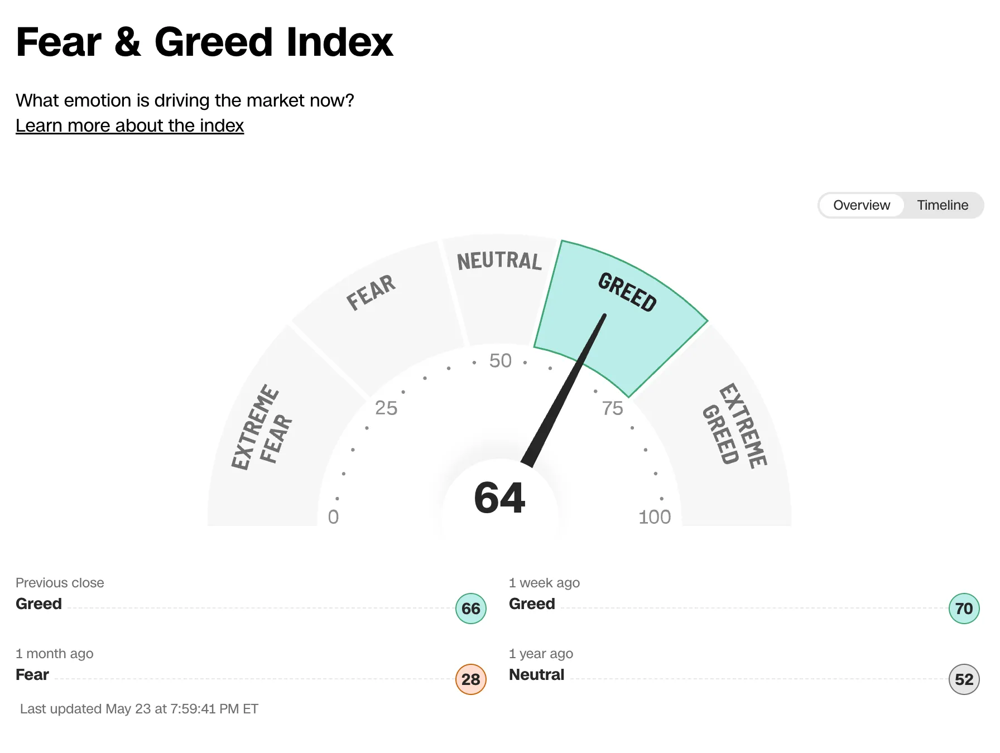
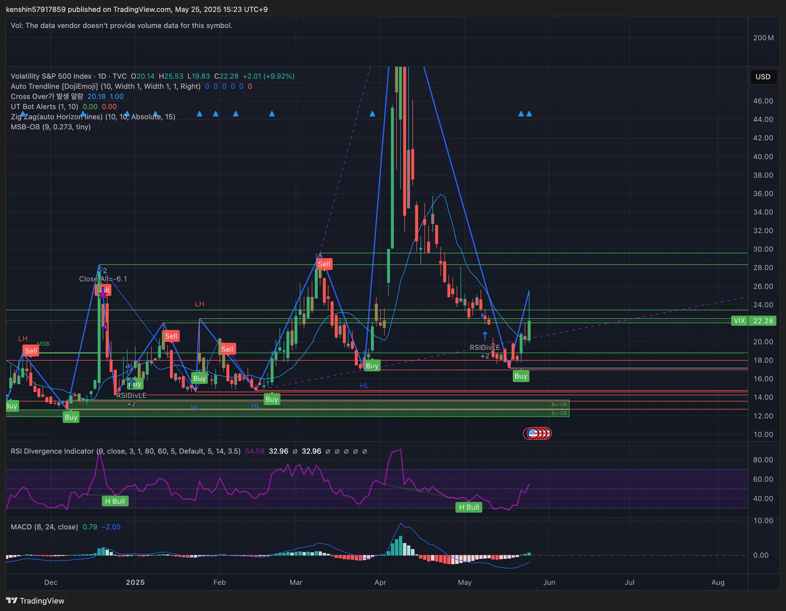
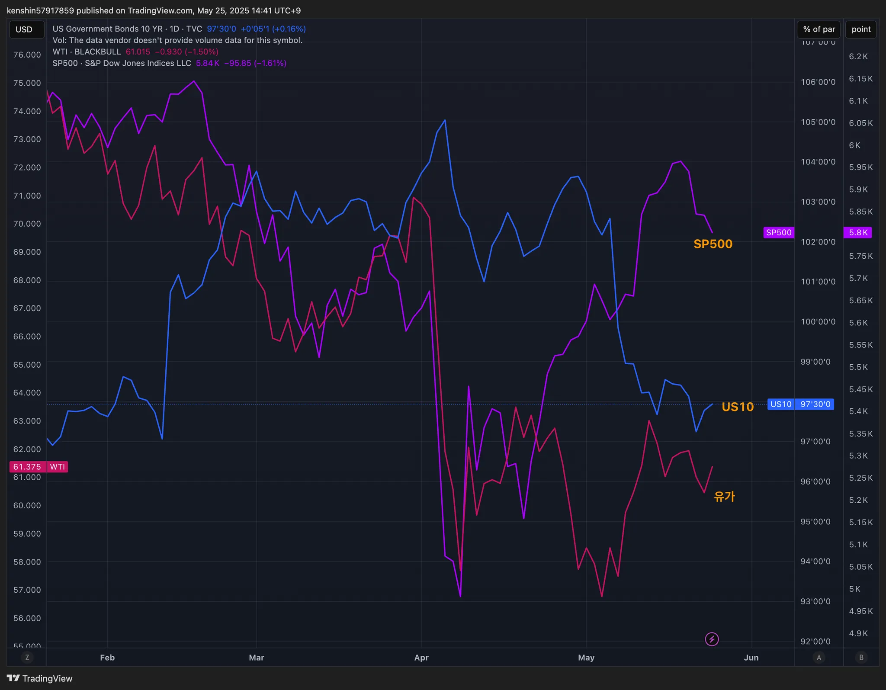
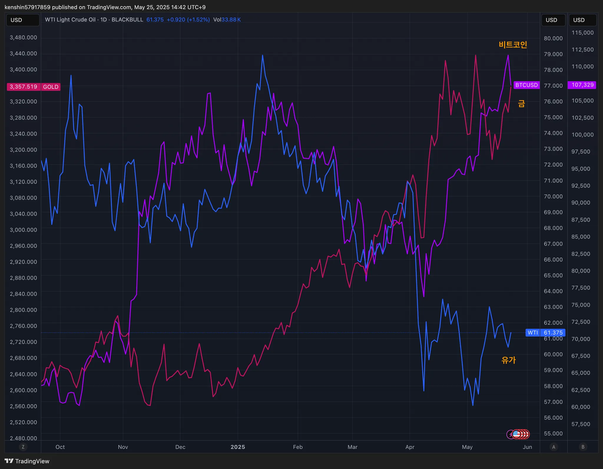

## 섹터별 수익률

> ETF 수익률을 기준으로 섹터별 수익률을 정렬하고 시간이 지남에 따라 현재 시장에서 주목받는 섹터가 무엇인지 파악하기 위해 아래와 같이 수익률을 정리해보았다.
>
> 단순히 수익률 기준으로 정렬을 하고 있어서 해당 섹터가 시장에서 가장 주목 받고 있다고 단정하기는 어렵지만, 투자하는 데 참고 지표로 사용하면 될 것 같다.

## 1. 국내 ETF

- 트럼프 원자력 관련 행정명령에 서명하면서 원전, 원자력 산업에 대한 기대감으로 크게 상승하고 있다
- 국내 엔터테인먼트 관련주들이 올해 1분기 호실적을 기록, 중국 정부의 한한령(한류 제한령) 해제에 대한 기대감으로 상승하는 추세이다

### 섹터별 ETF 종목

| **섹터** | **종목**               | **섹터**      | **종목**              |
| ---------- | ---------------------- | ----------------- | ---------------------- |
| 🔫방산      | PLUS K방산             | ☕️필수소비재       | KODEX 필수소비재       |
| ☢️원자력    | HANARO 원자력iSelect   | 🎮게임             | KBSTAR 게임테마        |
| ⚱️금        | ACE KRX금현물          | 🏠리츠부동산인프라 | TIGER 리츠부동산인프라 |
| 🏥헬스케어  | TIGER 헬스케어         | 💾소프트웨어       | TIGER 소프트웨어       |
| 🚢조선      | HANARO Fn조선해운      | 🍕K-푸드           | HANARO Fn K-푸드       |
| 🤖로봇      | KODEX K-로봇액티브     | ✈️여행             | TIGER 여행레저         |
| 👩‍🎤엔터주   | HANARO Fn K-POP&미디어 | 🇨🇳중국소비테마    | TIGER 중국소비테마     |
| ➗고배당주  | PLUS 고배당주          | 🚘자동차           | KODEX 자동차           |
| 💵은행      | KODEX 은행             | 반도체            | KODEX 반도체           |
| 🚧건설      | TIGER 200 건설         | 💄화장품           | TIGER 화장품           |
| 🧬바이오    | KODEX 바이오           | 🎭웹툰&드라마      | KODEX Fn웹툰&드라마    |
| 🪫2차전지   | TIGER 2차전지테마      | 🤖AI 반도체        | TIGER AI반도체핵심공정 |
|            |                        | 🧪화학             | KODEX 에너지화학       |

## 2. 미국 ETF

- 이번주는 거의 모든 섹터가 플러스로 전환하기 사직했다

### 섹터별 ETF

| 섹터         | **티커** | **섹터**      | **티커** |
| ------------ | -------- | ------------- | -------- |
| 🤖로봇        | BOTZ     | 핀테크        | FINX     |
| 🌧️클라우드    | CLOU     | 소비순환재    | XLY      |
| 🏥헬스케어    | XLV      | 🧬바이오섹터   | IBB      |
| ⚱️금          | GLD      | ⌹SCHD         | SCHD     |
| 🏭산업재      | XLI      | 🏦금융         | XLF      |
| ⚡️에너지      | XLE      | S&P500        | VOO      |
| 러셀2000     | IWM      | ☕️경기방어주   | XLP      |
| 🔌구리        | COPX     | 🔐사이버 보안  | CIBR     |
| 🌉미국 인프라 | PAVE     | ☕️소재         | XLB      |
| 🏠리츠        | XLRE     | 반도체        | SOXX     |
| 🛢️WTI유       | CL       | 🖥️정보기술     | XLK      |
| 🛠️유틸리티    | XLU      | 나스닥100     | QQQ      |
| 📄장기채      | TLT      | ☎커뮤니케이션 | XLC      |
| ➗배당        | DIA      | 🪫2차전지      | LIT      |

## 3. 주요 지표

### 3.1 환율, 채권, VIX

- 환율: 환율도 내려가고 있는 추세이다
  - 달러는 적립식으로 꾸준히 매수할 필요가 있다
- VIX: 관세부과로 인한 공포지수는 많이 사그러진 듯하다

### 3.2 S&P500, US10, WTI유가

- S&P500: 회복하는 듯했지만, 아직 정리되지 않은 관세로 인해서 S&P500, 나스닥은 올라갔다가 내려가고 있는 추세이다.
  - 미국의 신용등급이 한 단계 강등하게 되어 미국 주식 시장에 대한 불안 요소가 존재를 한다

### 3.3 BTC, GOLD, WTI

- 비트코인 가격이 사상 최고가를 경신하는 등 강한 상승세를 기록중이다
  - `스테이블코인 법안`이 통과되면서 가상자산이 제도권에 진입한다는 기대감이 커졌기 때문으로 해석된다

## 4. 주요 트렌드 정리

### 주요 일정 (5/26 ~ 5/30)

|      | 월          | 화                | 수   | 목                                                           | 금                                                 |
| ---- | ----------- | ----------------- | ---- | ------------------------------------------------------------ | -------------------------------------------------- |
| 일정 | 🇺🇸 미장휴장 | 🇺🇸 소비자신뢰지수 |      | 🇰🇷 한국은행 금융통화위원회 🇰🇷 대통령 사전선거 🇺🇸 1분기 경제성장률 🇺🇸 신규 실업수당 청구건수 | 🇺🇸 개인소비자(PCE) 물가지수 🇰🇷 대통령 사전선거 |
| 실적 |             | 🇰🇷 삼양식품       |      | 🇺🇸 NVDA 🇺🇸 COST 🇰🇷 삼성증권 🇰🇷 LS 🇰🇷 삼성물산 |                                                    |

### 다음주

- 🇺🇸 엔비디아(NVIDIA) 1분기 실적 발표: AI·반도체 섹터에 큰 영향 예상
  - 엔비디아, 새로운 저가형 중국용 AI 칩 개발중 
- 🇺🇸 또다시 관세 전쟁중
  - 🇺🇸 🇰🇷 6월 말에 스마트폰 25% 관세
    - 애플, 삼성 주식에 영향을 갈 거라서 어떻게 대응할지 고민이 필요하다
  - 🇪🇺 트럼프 'EU산 50% 관세' 폭탄 선언으로 명품 주가 일제히 하락
    - 줍줍할 기회라고 생각이 든다
- 🇰🇷 대통령 사전선거
- 🇰🇷 한국 대통령 선거 후보자 TV토론(20시~22시): 대선 테마주·정치 관련주 변동성 주의

## 5. 참고

- [증시일정](https://securities.miraeasset.com/hkr/hkr1003/n13.do)
- [한국 결제캘린더](https://kr.investing.com/economic-calendar/)
- [주부엉의 주식레시피](https://contents.premium.naver.com/owlstock/owlrecipe/contents/250427192358200fr)
- [YH 시장분석소](https://yhw5285.tistory.com/457)
- [주식권리일정](https://seibro.or.kr/websquare/control.jsp?w2xPath=/IPORTAL/user/company/BIP_CNTS01020V.xml&menuNo=273)
